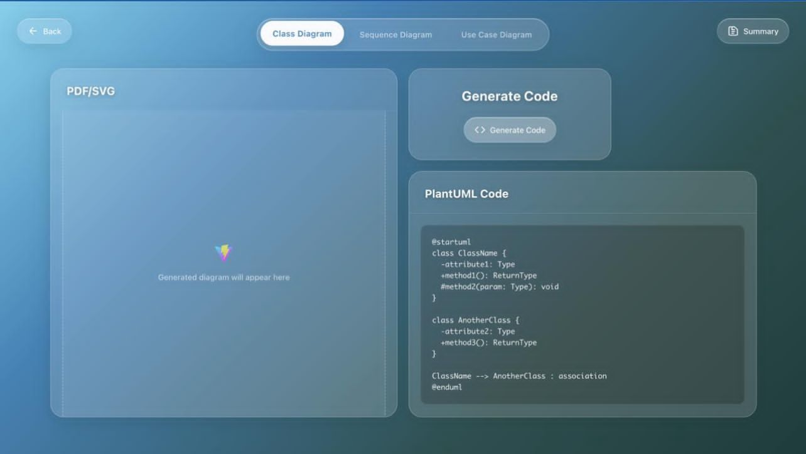

# TalkToTech - Turn Conversations Into Diagrams & Code

## AI & Automation Unpacked Hackathon Submission

**Turn conversations into UML diagrams & code. From verbal ideas to technical implementation instantly.**

🌐 **Live Demo:** [https://talktotech-ai.vercel.app/](https://talktotech-ai.vercel.app/)  
*Note: Live preview may not fully function due to disabled/depleted API tokens*

📹 **Video Demo:** [Watch our 3-minute demonstration](https://drive.google.com/file/d/1j11mzUInQ6gtEBuJ_EXZC_NRCrz9pROh/view?usp=sharing)  

💡 **Want to test the full functionality?** Download the repo locally, sign up at [Replicate](https://replicate.com), get your own API token, and replace it in the configuration files!

This repository showcases AI-powered automation solutions developed during the **IBM AI & Automation Unpacked Hackathon** at **IBM TechXchange 2025** (June 26-29, 2025). Our project focuses on leveraging **IBM Granite models** to create innovative tools that transform spoken technical conversations into structured, production-ready system diagrams.

---

## 🚀 The Challenge

The hackathon's core objective was to design and build proof-of-concept AI solutions using IBM Granite models (including Granite 3.3 for reasoning and speech, and Granite 4.0 Tiny for long-context tasks). These models are designed for enterprise applications, enabling automation, enhanced decision-making, and innovation across various domains.

---

## 🎯 The Problem We Solve

**Most technical meetings are goldmines of ideas. But here's the problem — most of that gold never leaves the room.**

Developers talk. Architects plan. PMs listen. But when it comes time to capture it all? You get scattered notes, outdated diagrams, and wasted potential.

That's the bottleneck we're breaking.

---

## ✨ Our Solution: TalkToTech

**An AI-powered system that turns spoken technical conversations into structured, production-ready system diagrams — all in one flow.**

### How It Works

1. **Drop your audio file** - Simple upload interface
2. **AI transcription** - Surgical precision speech-to-text conversion
3. **Intelligent analysis** - IBM Granite Instruct reads between the lines, analyzes context, extracts keywords, chooses the right diagram type (sequence, class, architecture), and summarizes it all
4. **Code generation** - IBM Granite Code transforms insights into raw PlantUML and renders clear, professional diagrams with corresponding code in the most applicable programming language (Java, Python, SQL, etc.)

### What Makes Us Different

**It's not just AI — it's cognitive architecture.**

Our system thinks like a senior engineer. It doesn't keyword-match. It understands how systems behave, how components interact, and what diagram best captures the logic.

**We're not speeding up a broken process. We're replacing it.**

TalkToTech doesn't just save time — it preserves the brilliance that happens in the room.

---

## 🏗️ Technical Architecture

### Backend (Python + Flask)

Our modular AI pipeline reflects the technical workflow:

- **`meeting_processor`** - Handles audio transcription and transcript summarization using AI models
- **`diagram_selector`** - Takes raw transcript and uses Granite Instruct to output JSON with chosen diagram type and summary
- **`diagram_to_code`** - Uses Granite Code to generate PlantUML syntax from the JSON
- **`meeting_to_diagram`** - Renders PlantUML into SVG images
- **Decoupled architecture** - Connects specialized Granite models in a seamless workflow

### Frontend (React + Vite)

Single-page application providing a clean UI for the powerful backend:

- Audio file upload interface
- Real-time display of AI-generated summaries
- Dynamic SVG diagram rendering
- Intuitive, responsive user experience

### IBM Granite Integration

TalkToTech uses a streamlined pipeline powered entirely by IBM's **granite-3.3-8b-instruct** model:

1. **Transcription**: Uses `incredibly-fast-whisper` model (due to IBM Granite Speech's absence on Replicate) to convert spoken audio into text
2. **Understanding & Summarization**: Granite summarizes the transcript, extracts keywords, and assigns a fitting title
3. **Diagram Selection**: Based on relational/process cues, Granite identifies the best diagram type (e.g., sequence, class, architecture)
4. **UML and Code Generation**: Granite Code generates the chosen UML diagram(s) and their corresponding code in the best applicable programming language

---

## 👥 Our Team

All team members are students at the **German University in Cairo** in the **Media Engineering and Technology Faculty**, **Computer Science and Engineering major**:

* **Salma Tarek Soliman** - Computer Science & Engineering Student
* **Ahmed Dabour** - Computer Science & Engineering Student
* **Hatem Soliman** - Computer Science & Engineering Student
* **Yasmeen Tarek** - Computer Science & Engineering Student
* **Layla Khaled** - Computer Science & Engineering Student

---

## 🛠️ Technologies Used

* **IBM Granite Models**: Leveraging their capabilities for text generation, reasoning, summarization, and speech-to-text
* **IBM watsonx.ai**: Cloud-based platform for accessing and experimenting with Granite models
* **Python & Flask**: Backend API development
* **React & Vite**: Frontend single-page application
* **PlantUML**: Diagram generation and rendering
* **Incredibly Fast Whisper**: Speech-to-text transcription

---

## 📝 Getting Started

### Prerequisites

* Python 3.8+
* Node.js 16+
* Familiarity with IBM Granite models and their applications
* Understanding of IBM watsonx.ai for cloud-based model interaction

### Installation & Setup

1. **Clone the repository**

   ```bash
   git clone https://github.com/CodeNKoffee/talktotech-ai.git
   cd talktotech-ai
   ```

2. **Backend Setup**

   ```bash
   pip install -r requirements.txt
   ```

3. **Frontend Setup**

   ```bash
   cd my-app
   npm install
   npm run dev
   ```

4. **Configure IBM Granite API**
   - Set up your IBM watsonx.ai credentials
   - Configure API keys in the appropriate configuration files

For detailed setup instructions, please refer to the **AI & Automation Unpacked Hackathon Guide PDF**.

---

## 💡 Use Cases Addressed

TalkToTech addresses the universal challenge of **capturing and preserving technical meeting insights**:

* **Software Architecture Meetings**: Convert architectural discussions into UML diagrams
* **System Design Sessions**: Transform design conversations into sequence and class diagrams
* **Database Planning**: Turn database discussions into ER diagrams
* **API Design Meetings**: Convert API planning into interface diagrams
* **Process Workflow Discussions**: Transform process descriptions into activity diagrams

---

## ⚠️ Data Compliance Notice

In adherence to the hackathon guidelines, all data used in this project complies with responsible AI practices. We have ensured:

* No company confidential or unauthorized data
* No client data or Personally Identifiable Information (PI)
* No data obtained from social media
* Publicly available data, where terms permit commercial use, is documented

---

## 🔗 Resources

* [IBM Granite Official Page](https://www.ibm.com/granite)
* [IBM Granite Documentation (IBM Developer)](https://developer.ibm.com/components/granite-models/)
* [IBM watsonx.ai Platform](https://dataplatform.cloud.ibm.com/wx/home?context=wx)
* [PlantUML Documentation](https://plantuml.com/)
* [Incredibly Fast Whisper](https://github.com/SYSTRAN/faster-whisper)

---

## License

MIT License

Copyright (c) 2025 TalkToTech Team

Permission is hereby granted, free of charge, to any person obtaining a copy
of this software and associated documentation files (the "Software"), to deal
in the Software without restriction, including without limitation the rights
to use, copy, modify, merge, publish, distribute, sublicense, and/or sell
copies of the Software, and to permit persons to whom the Software is
furnished to do so, subject to the following conditions:

The above copyright notice and this permission notice shall be included in all
copies or substantial portions of the Software.

THE SOFTWARE IS PROVIDED "AS IS", WITHOUT WARRANTY OF ANY KIND, EXPRESS OR
IMPLIED, INCLUDING BUT NOT LIMITED TO THE WARRANTIES OF MERCHANTABILITY,
FITNESS FOR A PARTICULAR PURPOSE AND NONINFRINGEMENT. IN NO EVENT SHALL THE
AUTHORS OR COPYRIGHT HOLDERS BE LIABLE FOR ANY CLAIM, DAMAGES OR OTHER
LIABILITY, WHETHER IN AN ACTION OF CONTRACT, TORT OR OTHERWISE, ARISING FROM,
OUT OF OR IN CONNECTION WITH THE SOFTWARE OR THE USE OR OTHER DEALINGS IN THE
SOFTWARE.

---

*Developed for IBM AI & Automation Unpacked Hackathon at IBM TechXchange 2025*

## 👀 Preview

Here's a glimpse of the TalkToTech user interface in action:

| Audio Recording & Session Summary | Diagram & Code Generation |
|:---------------------------------:|:------------------------:|
|  |  |
